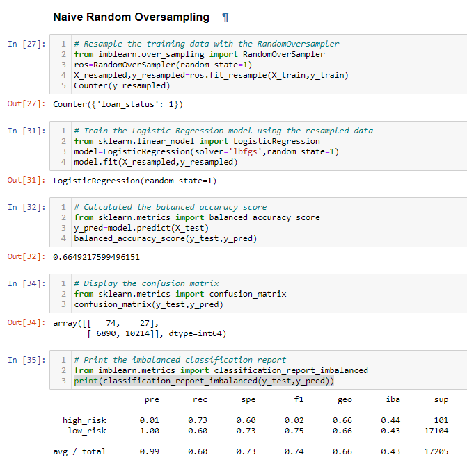
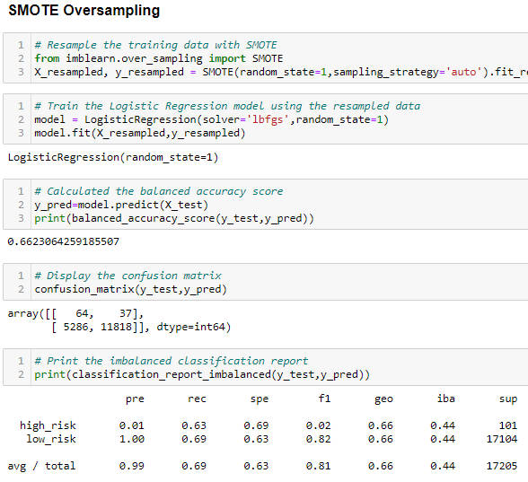
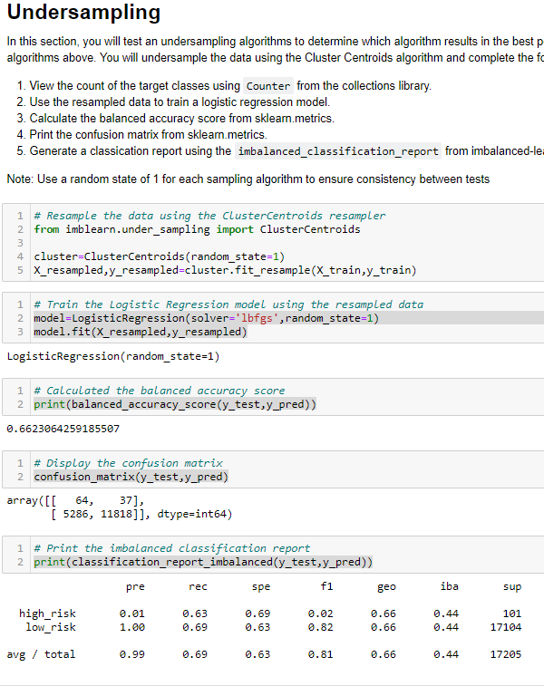
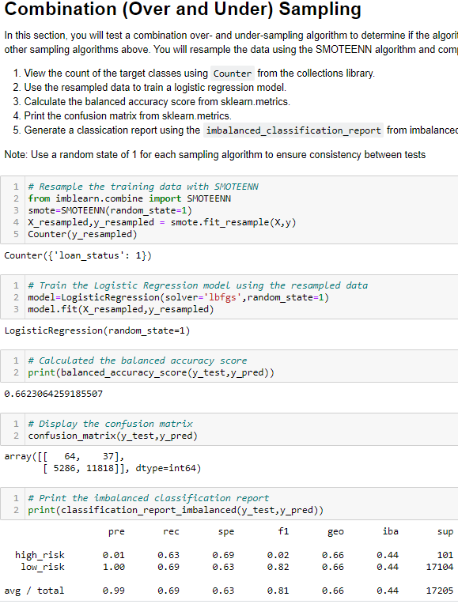
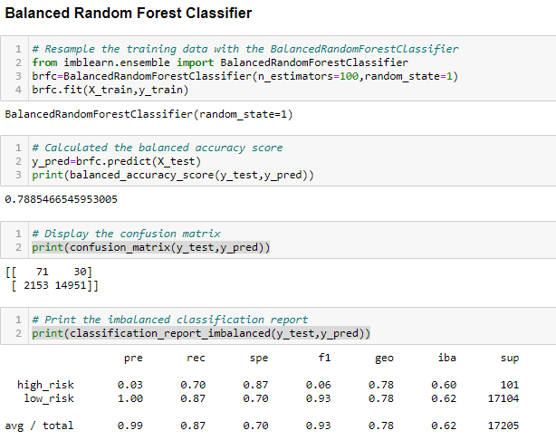
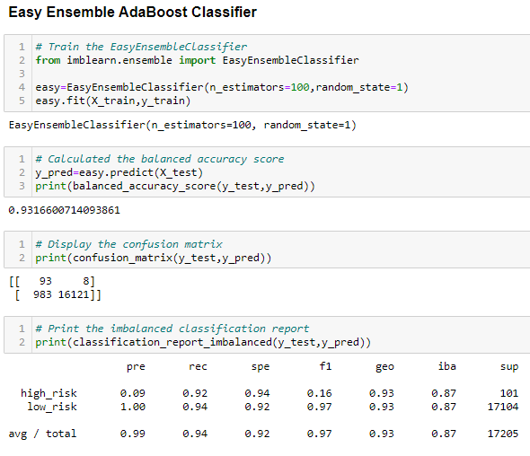

# Credit_Risk_Analysis

## Overview of the analysis

The purpose of this analysis is to use various supervised machine learning methods to predict credit risk.

## Results

*Please see images under each respective 6 models for balance accuracy scores, precision scores, and recall scores for the machine learning models*

**Naive Random Oversampling**

**SMOTE Oversampling**

**Undersampling**

**SMOTTEENN**

**Balanced Random Forest Classifier**

**Easy Ensemble AdaBoost Classifier**

## Summary
The first four machine learning models all had very average balanced accuracy scores that did not make them the best candidate to use for predictions. My recommendation on the model to use would be the Easy Ensemble AdaBoost Classifier since it had a balanced accuracy score of 0.93 and an average total recall score of 0.92.
